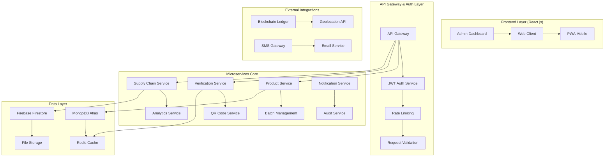
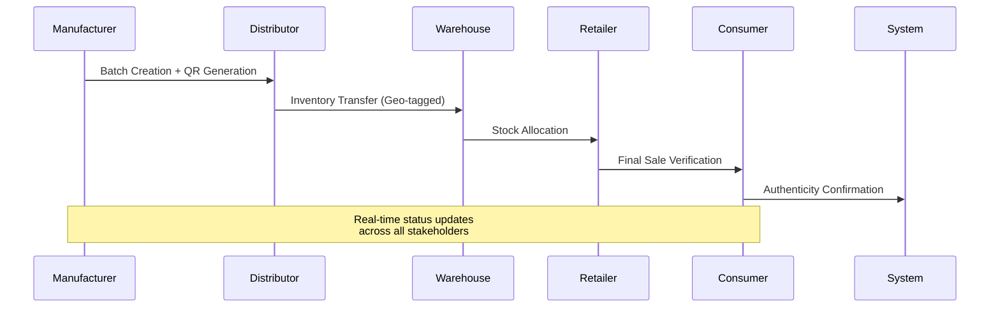
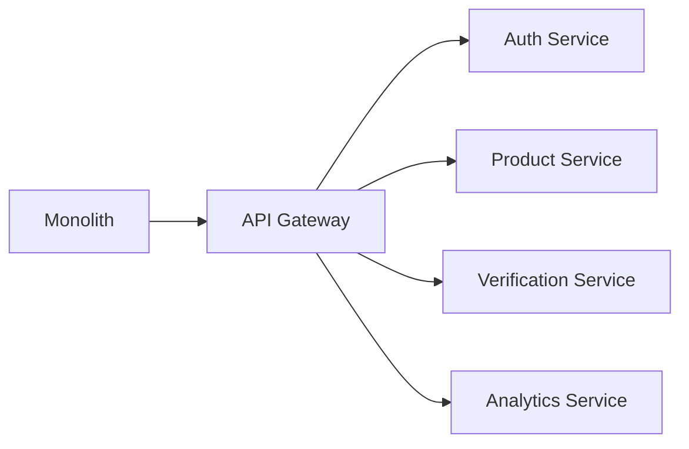

# 🔍 TrueCheck: Enterprise Product Verification & Supply Chain Platform

<div align="center">


**Enterprise-Grade Supply Chain Verification with Real-Time Authentication & Blockchain-Ready Architecture**

[](https://product-verification-two.vercel.app)
[](##-api-documentation)

</div>

---

## 🏗️ System Architecture Overview

### High-Level Architecture Diagram



---

## 🏆 Enterprise Features & Capabilities

### 🔐 Advanced Authentication & Authorization

```javascript
// Multi-tier RBAC Implementation
const RBAC_CONFIG = {
  COMPANY_ADMIN: {
    permissions: ['product:create', 'batch:manage', 'user:invite', 'analytics:view'],
    scope: 'organization'
  },
  QUALITY_CONTROLLER: {
    permissions: ['product:verify', 'batch:inspect', 'report:generate'],
    scope: 'facility'
  },
  RETAIL_MANAGER: {
    permissions: ['product:scan', 'inventory:manage', 'transfer:record'],
    scope: 'store'
  },
  END_CONSUMER: {
    permissions: ['product:verify', 'history:view'],
    scope: 'personal'
  }
};
```

### 📊 Real-Time Supply Chain Tracking



---

## 🛠️ Technical Stack Deep Dive

### Backend Infrastructure

<div align="center">

| Layer | Technology | Purpose | Scalability |
|-------|------------|---------|-------------|
| **Runtime** | Node.js 18+ LTS | Event-driven architecture | Horizontal scaling ready |
| **Framework** | Express.js 4.18+ | REST API with middleware chain | Modular route handling |
| **Database** | MongoDB Atlas 7.0+ | Document-based product data | Auto-scaling clusters |
| **Cache** | Redis 7.0+ | Session & QR code caching | Sub-ms response times |
| **Auth** | JWT + bcrypt | Stateless authentication | OAuth2 ready |
| **Validation** | Joi + Express-validator | Request sanitization | Schema enforcement |

</div>

### Frontend Architecture

```javascript
// Component Hierarchy with State Management
const APP_ARCHITECTURE = {
  core: {
    state: "React Context + Custom Hooks",
    routing: "React Router v6 with lazy loading",
    styling: "Tailwind CSS + CSS Modules",
    forms: "React Hook Form with validation"
  },
  services: {
    api: "Axios interceptors with retry logic",
    auth: "JWT refresh token rotation",
    realtime: "WebSocket + Socket.io client",
    storage: "Firebase SDK with offline support"
  },
  features: {
    qr: "jsQR with camera stream management",
    maps: "Geolocation API integration",
    analytics: "Custom dashboard components"
  }
};
```

---

## 🗄️ Database Schema Design

### Core Collections Structure

```javascript
// Products Collection (MongoDB)
const ProductSchema = {
  _id: "ObjectId",
  companyId: "ObjectId", // Reference to company
  name: "String", // Product name
  description: "String", // Detailed description
  category: "String", // Product category
  specifications: "Object", // Technical specs
  images: ["String"], // CDN URLs
  qrCode: "String", // Unique QR identifier
  batchSize: "Number", // Units per batch
  createdAt: "Date",
  updatedAt: "Date",
  metadata: "Object" // Custom fields
};

// Batches Collection
const BatchSchema = {
  _id: "ObjectId",
  productId: "ObjectId", // Parent product
  batchNumber: "String", // Unique batch ID
  manufacturingDate: "Date",
  expirationDate: "Date",
  quantity: "Number",
  status: "enum: ['active', 'recalled', 'expired']",
  qualityChecks: ["Object"], // QC records
  storageConditions: "Object" // Temperature, humidity
};

// Supply Chain Events Collection
const EventSchema = {
  _id: "ObjectId",
  productId: "ObjectId",
  batchId: "ObjectId",
  eventType: "enum: ['manufactured', 'shipped', 'received', 'sold']",
  fromEntity: "ObjectId", // Source entity
  toEntity: "ObjectId", // Destination entity
  location: {
    coordinates: ["Number"], // [long, lat]
    address: "String",
    timestamp: "Date"
  },
  metadata: "Object", // Customs, temperature logs
  verifiedBy: "ObjectId", // User who verified
  blockchainHash: "String" // Immutable record
};
```

### Indexing Strategy

```javascript
// Optimized Query Performance
db.products.createIndex({ "companyId": 1, "createdAt": -1 });
db.batches.createIndex({ "productId": 1, "manufacturingDate": -1 });
db.events.createIndex({ "productId": 1, "timestamp": -1 });
db.events.createIndex({ "location": "2dsphere" }); // Geospatial queries
db.users.createIndex({ "email": 1 }, { unique: true });
```

---

## 🔌 API Architecture & Endpoints

### RESTful API Design

```javascript
// API Versioning & Structure
const API_STRUCTURE = {
  base: "/api/v1",
  auth: {
    login: "POST /auth/login",
    register: "POST /auth/register",
    refresh: "POST /auth/refresh",
    logout: "POST /auth/logout"
  },
  products: {
    list: "GET /products",
    create: "POST /products",
    detail: "GET /products/:id",
    update: "PUT /products/:id",
    batches: "GET /products/:id/batches"
  },
  verification: {
    scan: "POST /verify/scan",
    manual: "POST /verify/manual",
    history: "GET /verify/history"
  },
  analytics: {
    overview: "GET /analytics/overview",
    products: "GET /analytics/products",
    geospatial: "GET /analytics/geospatial"
  }
};
```

### Sample Controller Implementation

```javascript
// Product Verification Controller
class VerificationController {
  async scanQR(req, res) {
    try {
      const { qrCode, scannerLocation } = req.body;
      const userId = req.user.id;
      
      // 1. Validate QR code format
      const validation = await this.validateQRFormat(qrCode);
      if (!validation.valid) {
        return res.status(400).json({ error: 'Invalid QR format' });
      }
      
      // 2. Check cache first for performance
      const cachedResult = await redis.get(`scan:${qrCode}`);
      if (cachedResult) {
        return res.json(JSON.parse(cachedResult));
      }
      
      // 3. Database lookup with transaction
      const session = await mongoose.startSession();
      session.startTransaction();
      
      try {
        const product = await Product.findOne({ qrCode }).session(session);
        if (!product) {
          await session.abortTransaction();
          return res.status(404).json({ error: 'Product not found' });
        }
        
        // 4. Create verification event
        const verificationEvent = new VerificationEvent({
          productId: product._id,
          userId,
          location: scannerLocation,
          type: 'qr_scan',
          status: 'verified'
        });
        
        await verificationEvent.save({ session });
        
        // 5. Update analytics
        await Analytics.updateOne(
          { productId: product._id },
          { $inc: { scanCount: 1 } },
          { session }
        );
        
        await session.commitTransaction();
        
        // 6. Cache result for 5 minutes
        const result = { product, verificationEvent };
        await redis.setex(`scan:${qrCode}`, 300, JSON.stringify(result));
        
        res.json(result);
        
      } catch (error) {
        await session.abortTransaction();
        throw error;
      } finally {
        session.endSession();
      }
      
    } catch (error) {
      logger.error('QR scan failed:', error);
      res.status(500).json({ error: 'Verification service unavailable' });
    }
  }
}
```

---

## 🔒 Security Implementation

### Multi-Layer Security Architecture

```javascript
// Security Configuration
const SECURITY_CONFIG = {
  authentication: {
    jwt: {
      secret: process.env.JWT_SECRET,
      expiresIn: '15m',
      refreshExpiresIn: '7d'
    },
    bcrypt: {
      saltRounds: 12
    }
  },
  rateLimiting: {
    windowMs: 15 * 60 * 1000, // 15 minutes
    max: 100 // limit each IP to 100 requests per windowMs
  },
  cors: {
    origin: process.env.ALLOWED_ORIGINS.split(','),
    credentials: true
  },
  helmet: {
    contentSecurityPolicy: {
      directives: {
        defaultSrc: ["'self'"],
        styleSrc: ["'self'", "'unsafe-inline'"],
        scriptSrc: ["'self'"],
        imgSrc: ["'self'", "data:", "https:"]
      }
    }
  }
};
```

### Data Validation Middleware

```javascript
// Joi Schema Validation
const productValidation = Joi.object({
  name: Joi.string().min(2).max(100).required(),
  description: Joi.string().max(1000).required(),
  category: Joi.string().valid('electronics', 'pharmaceutical', 'food', 'luxury').required(),
  specifications: Joi.object({
    weight: Joi.number().positive(),
    dimensions: Joi.object({
      length: Joi.number().positive(),
      width: Joi.number().positive(),
      height: Joi.number().positive()
    }),
    ingredients: Joi.array().items(Joi.string())
  }),
  batchSize: Joi.number().integer().min(1).max(100000).required()
});

// Custom Validator Middleware
const validateRequest = (schema) => {
  return (req, res, next) => {
    const { error, value } = schema.validate(req.body, {
      abortEarly: false,
      stripUnknown: true
    });
    
    if (error) {
      const errorDetails = error.details.map(detail => ({
        field: detail.path.join('.'),
        message: detail.message
      }));
      
      return res.status(422).json({
        error: 'Validation failed',
        details: errorDetails
      });
    }
    
    req.body = value;
    next();
  };
};
```

---

## 📈 Performance Optimization

### Caching Strategy

```javascript
// Redis Caching Implementation
class CacheService {
  constructor() {
    this.redis = new Redis(process.env.REDIS_URL);
    this.defaultTTL = 300; // 5 minutes
  }
  
  async get(key) {
    try {
      const cached = await this.redis.get(key);
      return cached ? JSON.parse(cached) : null;
    } catch (error) {
      logger.error('Cache get error:', error);
      return null;
    }
  }
  
  async set(key, value, ttl = this.defaultTTL) {
    try {
      await this.redis.setex(key, ttl, JSON.stringify(value));
    } catch (error) {
      logger.error('Cache set error:', error);
    }
  }
  
  async invalidatePattern(pattern) {
    try {
      const keys = await this.redis.keys(pattern);
      if (keys.length > 0) {
        await this.redis.del(...keys);
      }
    } catch (error) {
      logger.error('Cache invalidation error:', error);
    }
  }
}

// Usage in Services
class ProductService {
  constructor() {
    this.cache = new CacheService();
  }
  
  async getProductById(id) {
    const cacheKey = `product:${id}`;
    
    // Try cache first
    const cached = await this.cache.get(cacheKey);
    if (cached) return cached;
    
    // Cache miss - query database
    const product = await Product.findById(id)
      .populate('companyId')
      .lean();
    
    if (product) {
      await this.cache.set(cacheKey, product, 600); // 10 minutes TTL
    }
    
    return product;
  }
}
```

### Database Query Optimization

```javascript
// Optimized Aggregation Pipeline for Analytics
const getProductAnalytics = async (productId, timeframe = '30d') => {
  const matchStage = {
    $match: {
      productId: new ObjectId(productId),
      timestamp: { $gte: new Date(Date.now() - 30 * 24 * 60 * 60 * 1000) }
    }
  };
  
  const analytics = await VerificationEvent.aggregate([
    matchStage,
    {
      $facet: {
        scanStats: [
          {
            $group: {
              _id: '$status',
              count: { $sum: 1 },
              locations: { $addToSet: '$location' }
            }
          }
        ],
        timeSeries: [
          {
            $group: {
              _id: {
                date: { $dateToString: { format: '%Y-%m-%d', date: '$timestamp' } },
                status: '$status'
              },
              count: { $sum: 1 }
            }
          },
          { $sort: { '_id.date': 1 } }
        ],
        geographic: [
          {
            $group: {
              _id: '$location.city',
              count: { $sum: 1 },
              coordinates: { $first: '$location.coordinates' }
            }
          }
        ]
      }
    }
  ]);
  
  return analytics[0];
};
```

---

## 🚀 Deployment & DevOps

### Docker Containerization

```dockerfile
# Backend Dockerfile
FROM node:18-alpine

# Install dependencies
RUN apk add --no-cache \
    python3 \
    make \
    g++ \
    curl

# Create app directory
WORKDIR /usr/src/app

# Copy package files
COPY package*.json ./
COPY yarn.lock ./

# Install dependencies
RUN npm ci --only=production

# Copy source code
COPY . .

# Create non-root user
RUN addgroup -g 1001 -S nodejs
RUN adduser -S nextjs -u 1001

# Change ownership
RUN chown -R nextjs:nodejs /usr/src/app
USER nextjs

# Expose port
EXPOSE 3000

# Health check
HEALTHCHECK --interval=30s --timeout=3s --start-period=5s --retries=3 \
    CMD curl -f http://localhost:3000/health || exit 1

# Start application
CMD ["npm", "start"]
```

### Kubernetes Deployment

```yaml
# kubernetes/deployment.yaml
apiVersion: apps/v1
kind: Deployment
metadata:
  name: truecheck-backend
  labels:
    app: truecheck
    tier: backend
spec:
  replicas: 3
  selector:
    matchLabels:
      app: truecheck
      tier: backend
  template:
    metadata:
      labels:
        app: truecheck
        tier: backend
    spec:
      containers:
      - name: backend
        image: truecheck/backend:latest
        ports:
        - containerPort: 3000
        env:
        - name: NODE_ENV
          value: "production"
        - name: MONGODB_URI
          valueFrom:
            secretKeyRef:
              name: truecheck-secrets
              key: mongodb-uri
        resources:
          requests:
            memory: "256Mi"
            cpu: "250m"
          limits:
            memory: "512Mi"
            cpu: "500m"
        livenessProbe:
          httpGet:
            path: /health
            port: 3000
          initialDelaySeconds: 30
          periodSeconds: 10
        readinessProbe:
          httpGet:
            path: /ready
            port: 3000
          initialDelaySeconds: 5
          periodSeconds: 5
```

---

## 📊 Monitoring & Observability

### Application Metrics

```javascript
// Prometheus Metrics Collection
const client = require('prom-client');

// Create metrics
const httpRequestDuration = new client.Histogram({
  name: 'http_request_duration_seconds',
  help: 'Duration of HTTP requests in seconds',
  labelNames: ['method', 'route', 'status_code'],
  buckets: [0.1, 0.5, 1, 2, 5]
});

const verificationCounter = new client.Counter({
  name: 'verification_requests_total',
  help: 'Total number of verification requests',
  labelNames: ['type', 'status']
});

// Custom Business Metrics
class BusinessMetrics {
  static trackVerification(productId, status, duration) {
    verificationCounter.inc({ product: productId, status });
    httpRequestDuration.observe(duration);
    
    // Custom business logic metrics
    if (status === 'counterfeit') {
      this.alertSecurityTeam(productId);
    }
  }
}
```

### Logging Strategy

```javascript
// Structured Logging with Winston
const logger = winston.createLogger({
  level: 'info',
  format: winston.format.combine(
    winston.format.timestamp(),
    winston.format.errors({ stack: true }),
    winston.format.json()
  ),
  defaultMeta: { service: 'truecheck-backend' },
  transports: [
    new winston.transports.File({ filename: 'error.log', level: 'error' }),
    new winston.transports.File({ filename: 'combined.log' }),
    new winston.transports.Console({
      format: winston.format.simple()
    })
  ]
});

// Context-aware logging middleware
const requestLogger = (req, res, next) => {
  const start = Date.now();
  
  res.on('finish', () => {
    const duration = Date.now() - start;
    
    logger.info('HTTP request', {
      method: req.method,
      url: req.url,
      status: res.statusCode,
      duration,
      userAgent: req.get('User-Agent'),
      userId: req.user?.id || 'anonymous'
    });
  });
  
  next();
};
```

---

## 🎯 Future Architecture Roadmap

### Phase 1: Microservices Migration


### Phase 2: Event-Driven Architecture
- **Kafka Integration** for real-time event streaming
- **CQRS Pattern** for read/write separation
- **Event Sourcing** for audit trails

### Phase 3: Blockchain Integration
- **Hyperledger Fabric** for immutable records
- **Smart Contracts** for automated verification
- **IPFS** for decentralized file storage

---

## 📚 API Documentation

### Interactive API Docs
Visit `/api/docs` for interactive Swagger documentation with:
- **Request/Response schemas**
- **Authentication examples**
- **Error code documentation**
- **Rate limiting details**

### Sample API Client

```javascript
// JavaScript API Client
class TrueCheckAPI {
  constructor(apiKey, baseURL = 'https://api.truecheck.com/v1') {
    this.baseURL = baseURL;
    this.apiKey = apiKey;
  }
  
  async verifyProduct(qrCode, location) {
    const response = await fetch(`${this.baseURL}/verify/scan`, {
      method: 'POST',
      headers: {
        'Authorization': `Bearer ${this.apiKey}`,
        'Content-Type': 'application/json'
      },
      body: JSON.stringify({
        qrCode,
        location: {
          coordinates: [location.longitude, location.latitude],
          address: location.address
        }
      })
    });
    
    if (!response.ok) {
      throw new Error(`API Error: ${response.status}`);
    }
    
    return response.json();
  }
  
  async getProductHistory(productId, options = {}) {
    const params = new URLSearchParams(options);
    const response = await fetch(
      `${this.baseURL}/products/${productId}/history?${params}`,
      {
        headers: { 'Authorization': `Bearer ${this.apiKey}` }
      }
    );
    
    return response.json();
  }
}
```

---

<div align="center">

## 🏆 Technical Achievement Highlights

**Architecture Excellence • Enterprise Scalability • Production Ready**

[](https://vercel.com/new/clone?repository-url=https://github.com/hack-09/product-verification)
[](https://product-verification-two.vercel.app)

**Built with architectural excellence and enterprise-grade patterns**

</div>
